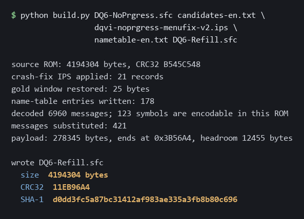

# DQ6 Script Refill

A patch that completes the untranslated messages in the **NoPrgress** English
translation of *Dragon Quest VI: Maboroshi no Daichi* for the Super Famicom,
and folds in two crash fixes.

---

## This is somebody else's work, and almost all of it

**NoPrgress translated this game.** 6,539 of the 6,960 messages in the main
script are theirs. Every character voice, every place name, every item and
spell and joke you will read is theirs. This patch adds 421 messages, six
percent, and spends most of its effort trying to sound like the other
ninety-four.

**DeJap** did the foundational Dragon Quest VI translation work that this line
of hacks descends from, and their name belongs alongside NoPrgress's whenever
this translation is discussed.

Nothing here replaces, corrects or improves their translation. Their text is
untouched: all 6,539 of their messages are byte-identical to the ones they
shipped, and that is verified on every build. Where their choices differ from
series convention, **their choices win** and this patch follows them. Luisa
rather than Ruida. Amoru. Erika. "the castle of the gods" rather than Zenithia.
The Sword of Ramias, the Shield of Sufida, the Armor of Orgo, the Helm of
Cevas. Those are their calls and this patch defers to them everywhere.

If you enjoy playing this game in English, that is their doing. Please go and
say so to them, not to me.

---

## What this patch does

The translation shipped with 421 messages never written. In play they display
as raw data where dialogue should be: 416 show their own message ID as decimal
digits, so an NPC says `3020`, and 5 show the string `TEXT` and their ID, like
`TEXT6478`. They sit between IDs 2,894 and 6,956, in the latter half of the
game, and they cluster: 15 runs of eight or more consecutive messages, the
longest 41 in a row. That is why entire locations can read as nothing but
numbers.

This patch writes those 421 messages, in English, from the Japanese original.

It also writes **178 name-table entries** - item, spell, skill, place,
monster-action and menu names the translation left showing the game's own
internal identifier, so a location read `M194` and a battle action read `M6BA`.
See "Scope" below for what was deliberately left alone and why.

It also includes both crash fixes from
[DQVI_NOPRGRESS_MENU_FIX](https://github.com/RadMageIRL/DQVI_NOPRGRESS_MENU_FIX):
the **Info > All** crash and the **Forget** crash. You do not need to apply that
patch as well. This one contains it.

- **Info > All** hangs if you back out before the screen finishes drawing. A
  three-byte `STA $3AC2` was deleted from `$C3:3538`, so the party-slot loop
  bound keeps a stale `$FF` sentinel and the loop runs past the end of the
  party. Fixed by restoring 87 bytes from the Japanese ROM.
- **Forget** crashes because of a memory allocation collision, not a logic bug:
  the translation put word-wrap state inside a block the original game clears
  wholesale. Fixed by relocating three variables across 19 sites, operands
  only. **Keep savestates the first time you use Forget.**

[`docs/CRASH-FIXES.md`](docs/CRASH-FIXES.md) has the detail, including what
these fixes deliberately do not do.

And it restores the **gold window on the info screen**, which the translation
lost. See below.

## The gold window

Open the info screen in the Japanese game and your gold is in the top right.
Open it in the English translation and it is not there at all.

**What happened.** English stat labels are wider than Japanese ones, so the
status window was widened to fit them. That left the gold window with nowhere to
sit:

```
Japanese   status cols 10-21   gold cols 22-30    side by side
English    status cols 10-24   gold cols 16-23    gold underneath the status window
```

Having no room for it, the translation deleted the call that draws the gold
figure - seven bytes - and padded the gap so the surrounding code still lined
up. The same technique appears four bytes earlier in the deletion that causes
the Info > All crash, so the two were almost certainly done in the same sitting.

**What this patch does.** It moves the gold window to the top left, where the
English layout has room, and puts the draw call back. The window draws the same
one-byte `G` string that the translation's *other* gold window already uses -
their own substitution, applied to the one place they did not apply it.

Nothing else moves. Only the gold window's own descriptor changes; the status
window, the command menu and every other window are byte-identical to the ones
NoPrgress shipped.

**This restores original behaviour rather than adding anything.** The gold
window is the game's, not ours. It was in Dragon Quest VI in 1995 and it is
back.

## Applying it

Patch a **headerless** NoPrgress-translated ROM.

```
source   CRC32 B545C548
result   CRC32 11EB96A4   SHA-1 d0dd3fc5a87bc31412af983ae335a3fb8b80c696
```

`DQ6-SFC-NoPrgress-RM-ScriptRefill.bps` is preferred. The `.ips` is provided for
tools that cannot read BPS. Use [Flips](https://www.romhacking.net/utilities/1040/)
or any equivalent.

## Building it yourself

The patch is reproducible. `build.py` performs every step - the crash fixes,
the gold window, the name table and the message script - so the files in this
repository reproduce the released ROM byte for byte from a stock NoPrgress ROM.
It is standard-library Python only, no dependencies.

```
python build.py DQ6-NoPrgress.sfc candidates-en.txt                 dqvi-noprgress-menufix-v2.ips                 nametable-en.txt DQ6-Refill.sfc
```



If your output does not match `11EB96A4`, the input ROM is not the one this
targets. Check its CRC32 before anything else.

The crash-fix IPS is the v2 patch from
[DQVI_NOPRGRESS_MENU_FIX](https://github.com/RadMageIRL/DQVI_NOPRGRESS_MENU_FIX).

## How the 421 messages and 178 names were written

From the Japanese script and from NoPrgress's own English, and from nothing
else. No later official localization was consulted at any point, including for
checking. Where a term had no precedent in their text, the earlier NES-era
Dragon Warrior convention was used, being earlier rather than later.

Their finished 6,539 messages were treated as the specification. Names came
from their spellings. Vocabulary came from their choices. Layout limits were
measured from their pages rather than guessed, and so was voice: their habit of
breaking a sentence with an exclamation mark where the Japanese hesitates, for
instance, is reproduced at the rate they use it and in the places they use it.

The name-table entries were held to the same rule, which repeatedly overrode
what read better in isolation. `ゆうわくおどり` is `Entice Dance` because that is
their existing rendering; `かみのふね` is `Ship of the Gods` because their text
already fixes `神の` as "of the gods"; `てきぜんたい` is `Enemies`, not
`All Enemies`, because that is how they render it elsewhere. Line lengths were
measured per region against their own entries rather than assumed - the caps
differ, from 9 characters a line for battle actions to 19 for place names.

[`docs/METHOD.md`](docs/METHOD.md) describes the approach in full, including the
parts that went wrong, and is written so it can be followed for a different SNES
translation.

## Scope: what is complete and what is not

**The message script is complete.** All 421 untranslated messages are written,
which is every one in the 6,960-message dialogue system. That is verified on the
built ROM rather than asserted: it is decoded back out and checked for both
known placeholder forms, and the result is zero of each.

**The name table is done too.** Item, spell, skill, place, monster-action and
menu names are a separate system from the message script: byte-encoded rather
than Huffman-coded, stored in different tables, reached a different way. It had
never been censused before this project. **370 of its entries were untranslated**
and displayed the game's own internal identifier, so a location read `M194` and
a battle action read `M6BA`.

**178 of those are now written.** The other 178 are deliberately left alone,
and 14 are unresolved. That split is the point, so here it is in full:

| | count | |
|---|---|---|
| **written** | **178** | monster actions, Goof-off actions, skill descriptions, place names, menu and status labels |
| left alone | 178 | see below |
| unresolved | 14 | see below |

### Why half of it is deliberately untranslated

Not one of these 178 can appear on screen:

- **52** are the name-entry rejection list - the words the naming screen
  refuses. They are compared against what you type and never drawn. Translating
  them would mean authoring a list of English obscenities into a ROM, which is
  a content decision rather than a translation, and it would change nothing.
- **21** are the name-entry kana grid, dead in English because the translation
  replaced the character set.
- **105** are map-editor and debug labels left in the ROM: `EDIT`, `RESIZE`,
  `MOVE`, `OBJ0`-`OBJ3`, `LV0`-`LV3`, `X:`, `Y:`, and map slots carrying
  internal codes like `C02` and `C01SHIPR`.

Eleven of those debug labels were only identifiable after working out that
Japanese bytes `$8C`-`$A5` are the full-width Latin alphabet. Before that they
decoded as unmapped kanji and looked like ordinary text. Without that find they
would have been translated unnecessarily, and three map slots would have been
given invented names.

### The 14 that are not settled

Four have an identifier whose prefix is not `M` or `*`, so the ID does not
resolve and there is no way to read their Japanese at all - `E01`, `D07`,
`C030`. Three carry an internal map code inside the Japanese itself. Five are
genuinely ambiguous - `ひき` is either a counter or "draw"; `そうぞう` is either
"imagine" or "create". One, `がた`, is an honorific pluralising suffix with no
English equivalent. And one is a single kana that is almost certainly a
fragment rather than a word.

Every one of them is left showing its identifier. **A gap is better than a
confident wrong answer**, and inventing a reading for a two-kana entry is
exactly how a translation acquires errors that nobody can later trace.

## What else this does not do

- **It does not fix the unbounded word-wrap fill** the translation carries. The
  Forget fix moves that buffer out of harm's way and gives it 200 bytes of
  headroom against a 136-byte worst case, but it does not bound the fill. That
  remains an open defect. See [`docs/CRASH-FIXES.md`](docs/CRASH-FIXES.md).
- **It does not touch a word of NoPrgress's own text.** Every one of their 6,539
  messages is byte-identical to what they shipped, and that is verified on every
  build rather than asserted.
- **It does not claim to be complete or correct.** 421 messages and 178 names
  were authored by someone who is not a professional translator, checked against
  a corpus rather than against a native speaker. Errors are mine. Reports are
  welcome.

## Credits

- **NoPrgress** - the English translation. Nearly all of the text you will read.
- **DeJap** - the foundational Dragon Quest VI translation work this descends from.
- **Enix** - *Dragon Quest VI: Maboroshi no Daichi*, 1995.
- The **RetroGameTalk** user whose report first established that the missing
  messages were dialogue rather than menu strings, which is what started this.

## Licence

The tooling and the authored English in this repository are MIT licensed. That
covers this repository's contents only. It does not extend to the game, to the
NoPrgress translation, or to any ROM.

No ROM is distributed here and none ever will be.
