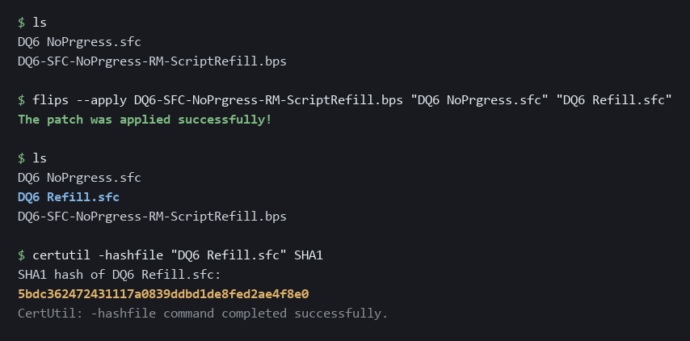
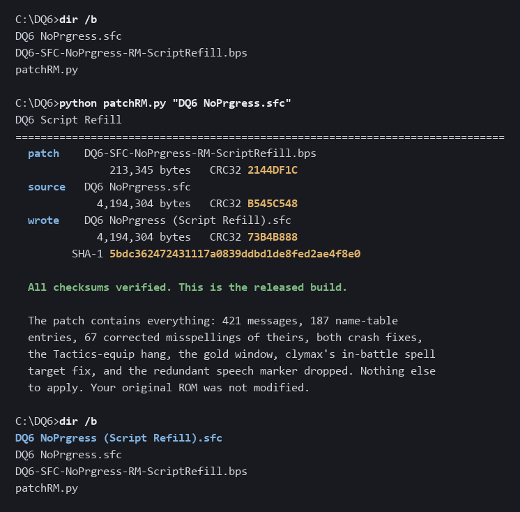

# DQ6 Script Refill

A patch that completes the untranslated messages in the **NoPrgress** English
translation of *Dragon Quest VI: Maboroshi no Daichi* for the Super Famicom,
and folds in the menu fixes: two crashes, the Tactics-equip hang, the gold
window, and the in-battle spell target list.

---

## Most of this is someone else's work

**NoPrgress translated this game.** 6,539 of the 6,960 messages in the main
script are theirs. Every character voice, every place name, every item and
spell and joke you will read is theirs. This patch adds 421 messages, six
percent, and spends most of its effort trying to sound like the other
ninety-four.

**DeJap** did the foundational Dragon Quest VI translation work that this line
of hacks descends from, and their name belongs alongside NoPrgress's whenever
this translation is discussed.

**clymax of ff5central.com** fixed the in-battle spell target defect. That fix
is his, not mine, and it is carried here with his permission. I worked out
afterwards why the byte he chose is the right one, and that account is mine, but
the fix is his. See
"The in-battle spell target list" below.

Nothing here replaces, rewrites or improves their translation. **Their wording
is unchanged**: not a line of their dialogue is rephrased, no register is
adjusted, no punctuation is touched, and that is verified on every build rather
than asserted. Two things do change in their text, both narrow, both listed in
full, and both checked mechanically.

**67 misspellings are corrected**, across 77 sites you can read in play. `Stength
Seed` is `Strength Seed`. `Congradulations` is `Congratulations`. `Ths king is
awake` is `The king is awake`. **Every correction and the reasoning behind it is
in [docs/TYPO-CORRECTIONS.md](docs/TYPO-CORRECTIONS.md)**, with the shipped text,
the corrected text and the length of every line before and after.

**The rule, stated so it cannot widen.** Their text is corrected only where one
of these holds:

> **A.** the ROM itself attests the correct spelling elsewhere in their own
> writing, or
> **B.** the shipped form is not an English word and has exactly one English
> spelling.

Nothing else. No rewording, no register, no grammar, no punctuation, no
phrasing. Clause A is not a promise, it is a check: `tools/verify.py` resolves
every clause-A target in the stock ROM and fails the build if the attestation it
rests on is not there. Thirteen further candidates the audit found are excluded
because each needs a judgment call somewhere, and they are listed with their
reasons in the same document.

A third thing changes no wording at all: a redundant marker symbol with no
English glyph is removed wherever it appeared. See "The speech marker" below.

**One name-table entry of theirs has been changed for a different reason**, and
it is the only one.
`$070B ぜっする` was rendered `Really`; it is now `Imagining`. This was not done
for style, or clumsiness, or accuracy on its own. It was done because that
rendering made an adjacent UNTRANSLATED entry impossible to complete:
`$070A そうぞうを` and `$070B ぜっする` are the two halves of 想像を絶する,
"beyond imagination", and no faithful English for the first half could sit
against `Really`. The pair now reads `Beyond` / `Imagining`. `ぜっする` occurs
exactly once in the table and `Really` was used exactly once, so nothing else
moved.

**The rule that one sets, stated so it cannot widen:** their text is *reworded*
only where their rendering blocks completing an untranslated entry. Not for
clumsiness, not for style, not for accuracy alone. One entry qualifies so far,
and it is a separate permission from the spelling rule above: that one changes
letters within a word, this one changes a word. Where their choices differ from
series convention, **their choices win** and this patch follows them. Luisa
rather than Ruida. Amoru. Erika. "the castle of the gods" rather than Zenithia.
The Sword of Ramias, the Shield of Sufida, the Armor of Orgo, the Helm of
Cevas. Those are their calls and this patch defers to them everywhere.

If you enjoy playing this game in English, that is largely their doing.

---

## What this patch does

The translation shipped with 421 messages never written. In play they display
as raw data where dialogue should be: 416 show their own message ID as decimal
digits, so an NPC says `3020`, and 5 show the string `TEXT` and their ID, like
`TEXT6478`. They sit between IDs 2,894 and 6,956, in the latter half of the
game, and they cluster: 15 runs of eight or more consecutive messages, the
longest 41 in a row. That is why entire locations can read as nothing but
numbers.

This patch writes those 421 messages, in English, from the Japanese original.

It also writes **187 name-table entries** - item, spell, skill, place,
monster-action and menu names the translation left showing the game's own
internal identifier, so a location read `M194` and a battle action read `M6BA`.
See "Scope" below for what was deliberately left alone and why.

And it corrects **67 misspellings in their own text**, at 77 sites you can read
in play. That is new in v4.0 and it is the first version of this patch to change
their spelling at all. The rule that permits it, the whole list, and the
thirteen candidates it deliberately leaves alone are in
[`docs/TYPO-CORRECTIONS.md`](docs/TYPO-CORRECTIONS.md).

### The Tactics-equip hang

Cycling in and out of a character's equipment through the Tactics menu locks the
game. It takes repeated cycling to reach, which is why it went unreported for so
long, and it affected **every published build** at the time it was found,
including all earlier versions of this patch and v1, v2 and v3 of the crash-fix
patch. The crash-fix patch now carries the same fix in its own **v4**.

`$C3:1AB1` is a broken duplicate of `$C3:1D0E`. Both answer the same question -
the cursor is on an entry that cannot be selected, so where should it go - and
`$C3:1D0E` answers it properly: it saves the ordinal, honours the carry that
`$C3:1B1E` returns, checks the floor, and if nothing is found below it restores
the ordinal and searches upward against a ceiling.

`$C3:1AB1` does none of that. It steps back once, unconditionally, and commits
whatever comes back. One step past zero hands `$C3:1B1E` an ordinal it cannot
satisfy. **`$C3:1B1E` reports that correctly** - it is bounded, and it returns
with carry set - and the caller never looks. The failure sentinel is then packed
as though it were a screen position:

```
linear = (112/2)*16 + 1 = 897      row = 897>>5 = 28      col = 897&31 = 1
```

The tilemap is `$3068`-`$3767`, exactly 28 rows, so **row 28 is one past the end
and lands on `$3768` - the cursor bitmap that the same code reads.** It corrupts
the structure it depends on, which is why the fault sustains itself once it
starts.

The fix mirrors `$C3:1D0E`'s search into `$C3:1AB1`. The initial check and the
redraw are untouched, so ordinary cursor movement is byte-identical.

**One visible behavioral change.** The cursor may land on a different entry
than before in edge cases, because it now searches down to the floor and up to
the ceiling instead of stepping back once. That is `$C3:1D0E`'s intended
behavior and it is what the game does everywhere else, but it is a change you
can see, not a pure bug fix, so it is stated rather than buried.

It also removes a **redundant speech marker**, all 676 occurrences of the one
symbol in their script with no English glyph behind it. It drew a stray shape
wherever it appeared, always after a marker the engine had already drawn. See
"The speech marker" below.

It also includes all three hang fixes from
[DQVI_NOPRGRESS_MENU_FIX](https://github.com/RadMageIRL/DQVI_NOPRGRESS_MENU_FIX):
the **Info > All** crash, the **Forget** crash, and the **Tactics-equip hang**.
You do not need to apply that patch as well. This one contains it.

- **Info > All** hangs if you back out before the screen finishes drawing. A
  three-byte `STA $3AC2` was deleted from `$C3:3538`, so the party-slot loop
  bound keeps a stale `$FF` sentinel and the loop runs past the end of the
  party. Fixed by restoring 87 bytes from the Japanese ROM.
- **Forget** crashes because of a memory allocation collision, not a logic bug:
  the translation put word-wrap state inside a block the original game clears
  wholesale. Fixed by relocating three variables across 19 sites, operands
  only. **Keep savestates the first time you use Forget.**

[`docs/CRASH-FIXES.md`](docs/CRASH-FIXES.md) has the detail, including what
these fixes deliberately do not do.

And it restores the **gold window on the info screen**, which the translation
lost. See below.

### The in-battle spell target list

**This one is clymax of ff5central.com's fix, not mine.** He wrote the one-byte
patch for it, and it is carried here with his permission.

In battle, choosing Fight and then a spell that targets an ally offers the whole
caravan rather than just the character or characters actually in the fight. You
can point at somebody who is not in the battle.

The cause is a substitution made fourteen times, of which thirteen were
harmless. A menu is built by appending entry IDs to a list, and an entry ID is
looked up in two separate Enix tables: one decides how the row is drawn, the
other decides which roster the menu enumerates. In the Japanese ROM, entry `$15`
and entry `$16` share a draw routine, which makes `$16` look like a spare slot,
and it is not one.

The translation needed a narrower name field for English, so it repointed
`$16`'s draw handler at a half-width routine of its own and swept thirteen menus
from `$15` onto `$16`. Those thirteen were safe, because `$15` and `$16`
enumerate the same roster and only the field width moved. The fourteenth
substitution landed on an entry that was `$38`, and `$38` enumerates a different
roster: the party in the battle rather than everyone travelling. So that one
menu began listing the caravan.

The fix restores the byte Enix shipped. Nothing is hooked, no free space is
used, and no behavior is added. It is a revert, and it is one byte.

[`docs/SPELL-TARGET.md`](docs/SPELL-TARGET.md) has the full account, with the
addresses, the two tables and how the reading was verified against the Japanese
ROM. There is an HTML copy of it beside it as
[`docs/SPELL-TARGET.html`](docs/SPELL-TARGET.html).

## The speech marker

The engine draws the opening mark on NPC dialogue itself: a star and a bracket
before the first word, the same thing the Japanese original draws. It does this
in every box that carries speech, ordinary villagers and shop clerks alike.

NoPrgress additionally wrote symbol `$0559` into the script **676 times**.
`$0559` is the one symbol in their script with no English glyph behind it, so
everywhere it appears it drew a stray two-part mark, and everywhere it appears
the engine had already drawn the real one.

```
before   * : <stray>Welcome to Amoru, town of water.
after    * : Welcome to Amoru, town of water.
```

It is removed outright rather than replaced, in every position: 534 opening a
message, 115 after the opening quote inside a tagged line, 25 after a context
control code, and 2 in the trailing filler past the last real message. What is
left is the engine's own marker.

**No wording changes.** The symbol carried no word, and the build fails if any
other symbol in any of their messages moves.

## The gold window

Open the info screen in the Japanese game and your gold is in the top right.
Open it in the English translation and it is not there at all.

**What happened.** English stat labels are wider than Japanese ones, so the
status window was widened to fit them. That left the gold window with nowhere to
sit:

```
Japanese   status cols 10-21   gold cols 22-30    side by side
English    status cols 10-24   gold cols 16-23    gold underneath the status window
```

Having no room for it, the translation deleted the call that draws the gold
figure - seven bytes - and padded the gap so the surrounding code still lined
up. The same technique appears four bytes earlier in the deletion that causes
the Info > All crash, so the two were almost certainly done in the same sitting.

**What this patch does.** It moves the gold window to the top left, where the
English layout has room, and puts the draw call back. The window draws the same
one-byte `G` string that the translation's *other* gold window already uses -
their own substitution, applied to the one place they did not apply it.

Nothing else moves. Only the gold window's own descriptor changes; the status
window, the command menu and every other window are byte-identical to the ones
NoPrgress shipped.

**This restores original behavior rather than adding anything.** The gold
window is the game's, not mine. It was in Dragon Quest VI in 1995 and it is
back.

## Applying it

**This is what you want if you just want to play.** One step, no Python.

**One patch contains everything** - the 421 messages, the 187 names, the 67
corrected misspellings, both crash fixes, the Tactics-equip hang, the gold
window and clymax's spell-target fix.
There is nothing else to apply and no order to get right. Do not apply the
menu-fix patch as well, and do not apply clymax's patch as well; this one
already contains both.

You need a **headerless** NoPrgress-translated ROM. There are two builds of it
in circulation and they are the same translation:

```
source   CRC32 B545C548     what this patch targets
         CRC32 276D9893     what RHDN translation 344 produces
```

**They differ in four bytes**, at `0x00FFDC`-`0x00FFDF`, and in nothing else.
NoPrgress's patch leaves the Japanese ROM's own internal checksum in place
rather than recomputing it over the patched data, so a freshly patched ROM
carries `$5E8F`, the Japanese value, while the copy that circulates in ROM sets
carries `$D17A`, which is correct for the translated data. Measured: RHDN 344
applied to the Japanese ROM (`33304519`) with a 512-byte header gives
`8D2AEBD5`, and `276D9893` once the header is removed.

**If yours is `276D9893`, use `patchRM.py` or `build.py`.** Both accept it,
correct those four bytes in memory and produce the identical released ROM. Your
file is not modified. For Flips, take the patch in [`RHDN/`](RHDN/) instead,
which targets that build and produces the same output.

**The root `.bps` will refuse it, and that is the format doing its job.** BPS
records the CRC32 of the ROM it expects. Rather than regenerating that patch,
which would move the problem onto everyone holding `B545C548`, there is a
second copy in [`RHDN/`](RHDN/) built against `276D9893`.

Then apply `DQ6-SFC-NoPrgress-RM-ScriptRefill.bps` with
[Flips](https://www.romhacking.net/utilities/1040/) or any equivalent.

**With the Flips window:** click *Apply Patch*, choose the `.bps`, then choose
your ROM. It writes the patched copy beside it. Your original is not modified.

**From a command line:**

```
flips --apply DQ6-SFC-NoPrgress-RM-ScriptRefill.bps "DQ6 NoPrgress.sfc" "DQ6 Refill.sfc"
```



**Without Flips at all**, if you have Python: `patchRM.py` applies the same
`.bps` and needs nothing installed. Put it beside the patch and your ROM.

```
python patchRM.py "DQ6 NoPrgress.sfc"
```



It checks the patch's own CRC32, refuses a wrong or already-patched ROM, and
verifies the output before telling you it worked. It accepts either source ROM
above. Standard-library Python 3, no dependencies.

Check what you get, whichever route you used:

```
result   CRC32 73B4B888   SHA-1 5bdc362472431117a0839ddbd1de8fed2ae4f8e0
```

That is the whole thing. **You are done** - the 421 messages, the 187 names,
the 67 corrected misspellings, both crash fixes, the Tactics-equip hang, the
gold window and clymax's spell-target fix are all in that one output file.

If the CRC32 does not match, your source ROM is not the one this targets. BPS
records its expected source, so Flips will normally refuse a wrong ROM rather
than producing a broken one - that is why the `.bps` is preferred.

The `.ips` is the same patch in an older format, for tools that cannot read BPS.
**IPS cannot check its input at all**: it will apply to anything and report
success. Use it only if you have to, and check the hash afterwards.

## Building it yourself

**You do not need this to play - the section above is the whole job.** This is
here so the patch does not have to be taken on trust: `build.py` rebuilds the released ROM from the English text in
this repository, so anyone can check that what the patch writes is what these
files say it writes, and get the same hash.

That is also why `candidates-en.txt` and `nametable-en.txt` are published. Every
authored line is readable text rather than something buried in a binary diff.

The patch is reproducible from this repository alone. `build.py` performs every
step - both crash fixes, the gold window, the name table and the message script
- so a stock NoPrgress ROM plus the two text files here reproduces the released
ROM byte for byte. Standard-library Python, no dependencies, and nothing is
fetched from anywhere else.

```
python build.py DQ6-NoPrgress.sfc candidates-en.txt nametable-en.txt DQ6-Refill.sfc
```


If your output is not `73B4B888`, the input ROM is not the one this targets.
Check its CRC32 before anything else.

The script refuses to write if the ROM is not what it expects. Every fix checks
its own site first - the crash-fix span, all 21 Forget relocation sites, and the
gold routine - so pointing it at the wrong ROM fails loudly rather than
producing something broken.

## How the 421 messages and 187 names were written

From the Japanese script and from NoPrgress's own English, and from nothing
else. No later official localization was consulted at any point, including for
checking. Where a term had no precedent in their text, the earlier NES-era
Dragon Warrior convention was used, being earlier rather than later.

Their finished 6,539 messages were treated as the specification. Names came
from their spellings. Vocabulary came from their choices. Layout limits were
measured from their pages rather than guessed, and so was voice: their habit of
breaking a sentence with an exclamation mark where the Japanese hesitates, for
instance, is reproduced at the rate they use it and in the places they use it.

The name-table entries were held to the same rule, which repeatedly overrode
what read better in isolation. `ゆうわくおどり` is `Entice Dance` because that is
their existing rendering; `かみのふね` is `Ship of the Gods` because their text
already fixes `神の` as "of the gods"; `てきぜんたい` is `Enemies`, not
`All Enemies`, because that is how they render it elsewhere. Line lengths were
measured per region against their own entries rather than assumed - the caps
differ, from 9 characters a line for battle actions to 20 for place names.

[`docs/METHOD.md`](docs/METHOD.md) describes the approach in full, including the
parts that went wrong, and is written so it can be followed for a different SNES
translation.

## Checking any of this

The claims above are measurements, so [`tools/`](tools/) holds the programs that
produce them. Each reads a ROM you supply and prints; none of them writes
anything, and there are no dependencies.

```
python tools/census.py    DQ6-NoPrgress.sfc            # 870 x 8 = 6,960 messages, 421 unwritten
python tools/census.py    DQ6-NoPrgress.sfc --roundtrip  # the byte-exact re-encode gate
python tools/charset.py   DQ6-NoPrgress.sfc            # the trees, and what can be written at all
python tools/nametable.py DQ6-NoPrgress.sfc            # the name table and the ID rule
python tools/verify.py    DQ6-NoPrgress.sfc DQ6-Refill.sfc
```

[`tools/README.md`](tools/README.md) maps each documented figure to the command
that reproduces it. Writing them corrected two things in the documentation,
both recorded there.

## Scope: what is complete and what is not

**The message script is complete.** All 421 untranslated messages are written,
which is every one in the 6,960-message dialogue system. That is verified on the
built ROM rather than asserted: it is decoded back out and checked for both
known placeholder forms, and the result is zero of each.

**The name table is done too.** Item, spell, skill, place, monster-action and
menu names are a separate system from the message script: byte-encoded rather
than Huffman-coded, stored in different tables, reached a different way. It had
never been censused before this project.

**In the stock ROM, 394 entries displayed the game's own internal identifier**,
so a location read `M194` and a battle action read `M6BA`. **186 are now
written, leaving 208 in the release build.** Every figure here was measured
against a ROM, and each says which ROM it describes:

| | stock `B545C548` | release `73B4B888` |
|---|---|---|
| entries displaying an identifier | **394** | **208** |
| written by this patch | - | **186** |

`tools/nametable.py --untranslated` reports 393 and 207. It matches a
single-letter prefix only, so it does not count `ID001`-`ID010` or `DS29`. The
difference between the two ROMs, 186, is the same either way.

### What the remaining 208 are

Established by reading the Japanese behind every one of them, resolved by the
entry's own string ID out of the Japanese ROM:

| | count | |
|---|---|---|
| naming-screen rejection list | **75** | compared against what you type, never drawn |
| internal labels | **62** | the Japanese is itself a Latin identifier |
| debug and editor labels | **70** | written in Japanese, unreachable in normal play |
| **genuinely unresolved** | **0** | all now written; two are inferred, see below |

**Not one of the first 207 can appear in normal play.**

The **75** are the words the naming screen refuses. Translating them would mean
authoring a list of English obscenities into a ROM, which is a content decision
rather than a translation, and it would change nothing.

The **62** were never translatable text at all, because the Japanese original
holds the same Latin string: `EDIT`, `RESIZE`, `MOVE`, `MAP`, `OBJ0`-`OBJ3`,
`LV0`-`LV3`, `X:`, `Y:`, `C01SHIPR`, `HP MP MAX`, and the `E01`, `D07`,
`S02`-`S45`, `K02`-`K12`, `ID001`-`ID010` slots. Several only read as garbage
because bytes `$0C`-`$0E` shadow H, M and P.

The **70** are map-editor and debug-menu labels: map tile attributes, castle map
slots, a debug menu with cheat-Zoom and a sound test, and a window debug block.
**These were missed for months because they are written in Japanese**, and the
search had been for Latin identifiers like `OBJ0`. Internal strings are not
required to be in the developer's second language.

Eleven of the Latin labels were only identifiable after working out that
Japanese bytes `$8C`-`$A5` are the full-width Latin alphabet. Before that they
decoded as unmapped kanji and looked like ordinary text. Without that find they
would have been translated unnecessarily, and three map slots would have been
given invented names.

### Nothing is left showing an identifier that is content

Every entry classified as untranslated content now has an English rendering.
What still displays an identifier is 208 entries that are **not** content: the
naming-screen rejection list, internal labels that are Latin in the Japanese
original, and the Japanese-written debug and editor menus. The table above says
which is which.

**Two of those renderings are the weakest calls in this patch, and they are
marked so.**

| shows | Japanese | written as | basis |
|---|---|---|---|
| `M14D` | `ばか` | **`Fool`** | reading only |
| `M14E` | `かみ` | **`God`** | reading only |

`ばか` is 馬鹿 and there is no competing reading; `Fool` is chosen over `Idiot`
as the shorter word and the better register for this series.

`かみ` has three readings and **`God` is a judgement, not a measurement.** It is
the strong favourite in a game carrying `かみのふね` (Ship of the Gods) and
`かみのさばきを` (Judgment), and the table renders 神 four times against 髪
twice. **The case for `Hair` is recorded so it can be checked rather than taken
on trust:** the two 髪 uses are `$06E7 かみをかきあげる` (Flip the Hair) and
`$089E ぎんのかみかざり` (Silver Tiara, a 髪飾り), and `$014F` immediately after
this entry is `そうしょくひん`, Accessories - ornaments. That adjacency is the
one thing pointing away from `God`.

**Both are category-unknown, which is what separates them from `がた`.** The
reference check that settled `$011C` and `$06FD` was run on both and came back
empty: neither is in the ability table, neither is a JSL argument to any string
routine, both `$014D` literal loads feed the hardware multiply register at
`$004202`, and `$014E`'s two write a parameter slot used 136 times elsewhere.
So these are written on **reading alone, with no positional evidence**, where
`がた` had code behind it. If any entry in this patch is wrong, it is one of
these two.

The standing position: a name in the right convention beats an untranslated
identifier, provided the docs mark it inferred. `M14D` and `M14E` on screen are
definitely wrong; `Fool` and `God` are probably right.

**`$011C がた` is written as `s`, and this one is MEASURED rather than inferred -
there is code behind it.** Enumerating every `LDA #imm / JMP $920C` in the ROM
gives exactly five emit sites, four of them name-table strings: `$0118 たち` as
`s`, this entry, `$011D みなさん` as `Everyone`, and `$011E あなた` as `You`.
Three of the handlers are byte-identical apart from the string ID, and each
calls the same test and emits nothing when it returns 1. **`がた` fires on the
plural branch exactly as `たち` does**, so it takes the same English plural.

That also disposes of the reading that had it attaching to `あなた` to make
`あなたがた`: `あなた` is emitted on the *opposite* branch of its handler, the
singular one, so `がた` and `あなた` are conditioned oppositely and can never
both fire.

**`*70A そうぞうを` is written, and it is the one case where their own text was
changed.** It and `$070B ぜっする` are the two halves of 想像を絶する, "beyond
imagination". Their `Really` for the second half left no faithful English for the
first, so the pair is now `Beyond` / `Imagining`. The words sit across the pair
rather than glossing each entry word for word, which is their own practice in
this region: `$0717 ちからをあわせ` is "combining power" and they render it
`Fury of` so that `Fury of` / `The gods` reads in order. `ぜっする` occurs once
in the table and `Really` was used once, so the change is contained.

**`M6EB デュランのもと` is written as `Off to|Duran`, and it is marked INFERRED.**
It is the one entry here written without a precedent for its head noun, so the
reasoning is recorded rather than assumed. `〜のもと` after a proper noun is the
ordinary locative, the `〜のもとで働く` sense, "at X's side"; the `素` reading,
which would give something like `Duran Mix`, wants a substance rather than a
person. It sits in the Goof-off random-action pool at slot 39 of 56, and the
pool's humour is things that make no situational sense - `Playing House`,
`Fake Blast`, `Solo Hand Game` - so a Goof-off wandering off to the demon lord
mid-battle is that joke. The ability table gives it a record at index 390, so it
IS selectable and a player will see it, which is what decided the trade: an
identifier on screen is certainly wrong, and a reasoned guess in the right
register is probably right.

Alternatives considered and recorded: `Duran's Side` (accurate, reads flat),
`Follow Duran` (good register, but see below), `Duran Mix` (the `素` reading the
proper noun argues against).

**`Follow Suit` was ruled out and that is worth keeping.** It had been suggested
that this entry might be the ability a later remake calls Follow Suit. It is
not. Follow Suit is `まねまね`, which is `$065D` in this table and which the
translation already renders as `Repeat`. It also sits in the battle-actions
region rather than the Goof-off pool, because it is a rank-learned ability and
the 56 are random actions - two different categories.

**`M6FD し` was reclassified, not translated.** It is not a Goof-off action at
all. The ability table at `0x08C674` holds 25-byte records that each begin with
their name's string ID, and the Goof-off run is records 351-407, IDs
`$06C4`-`$06FC`: the command label plus **56 actions**, contiguous, bounded by
null records at either end. **No record anywhere in that table carries `$06FD`.**
It is a name-table slot with nothing selecting it, so it belongs with the
internal entries rather than with untranslated content. `$06EB`, by contrast,
does have a record, at index 390, so it is a real selectable action.

**Two were resolved after this list was first written.** `M427`, `におうふくろ`,
is now `Stink Bag`: it sits immediately past a hard structural boundary - the
vocation rank ladders run 919 to 1062, exactly 18 groups of 8 - and is paired
there with `メガンテがかかるうでわ`, the only other modifier-plus-common-noun
entry nearby. That makes it a descriptive label rather than a name, and "the bag
that smells" parses as a description where 仁王袋 does not. The `におう` reading
is inferred.

`M0F5`, `ひき`, is the animal counter, and it is now **blank rather than
translated**. That is the translation's own convention for a string English does
not express: 75 of their entries are empty where the Japanese has content, none
of the Japanese entries are empty, and their `$0324` is the counter for flat
objects, which they blanked. `tools/verify.py` asserts it stays empty.

One small thing suggests these gaps are not arbitrary. The Goof-off block runs
50 entries, and the translation wrote 48 of them. The two they left are
`デュランのもと` and `し` - which are also the only two that break the block's
construction, the one `[X]の[Y]` naming a character and the one bare kana. Weak
evidence, and it proves nothing on its own, but whatever stopped them there is
probably what stops anyone.

**A gap used to be better than a confident wrong answer here, and for most of
this work it was.** What changed is that the guesses stopped being untraceable.
Every inferred entry is named in this file with what it rests on and what the
competing reading would be, so a disagreement can be checked rather than argued
about.

**Corrections are welcome, and they are cheap.** Every version from v1.0 to v1.9
is tagged with its patches attached, so the whole chain is recoverable. The
published data files are keyed by the game's own string ID, so a correction is a
one-line edit to `nametable-en.txt` and a rebuild. **If you see one of the
inferred entries in play and the context demands something else - `God` where it
should read `Hair`, say - report the string ID and what was on screen.** A wrong
guess costs a commit. An identifier on screen costs a player.

## What else this does not do

- **It does not fix the unbounded word-wrap fill** the translation carries. The
  Forget fix moves that buffer out of harm's way and gives it 200 bytes of
  headroom against a 136-byte worst case, but it does not bound the fill. That
  remains an open defect. See [`docs/CRASH-FIXES.md`](docs/CRASH-FIXES.md).
- **It does not reword a line of NoPrgress's own text.** Every symbol of their
  6,539 messages is what they shipped, apart from a redundant marker symbol
  removed wherever it appeared, which carried no word, and 76 corrected
  misspellings, every one of them listed in
  [`docs/TYPO-CORRECTIONS.md`](docs/TYPO-CORRECTIONS.md). The build fails if any
  other symbol in any of their messages moves, and it fails if a correction
  appears anywhere the list does not name.
- **It does not claim to be complete or correct.** 421 messages and 187 names
  were authored by someone who is not a professional translator, checked against
  a corpus rather than against a native speaker. Errors are mine. Reports are
  welcome.

## Credits

- **NoPrgress** - the English translation. Nearly all of the text you will read.
- **DeJap** - the foundational Dragon Quest VI translation work this descends from.
- **clymax of ff5central.com** - fixed the in-battle spell target defect. That
  fix is his work, carried here with his permission.
- **Enix** - *Dragon Quest VI: Maboroshi no Daichi*, 1995.
- The **RetroGameTalk** user GwardoJones whose report first established that the missing
  messages were dialogue rather than menu strings, which is what started this.

## License

The tooling and the authored English in this repository are MIT licensed. That
covers this repository's contents only. It does not extend to the game, to the
NoPrgress translation, or to any ROM.

No ROM is distributed here and none ever will be.
